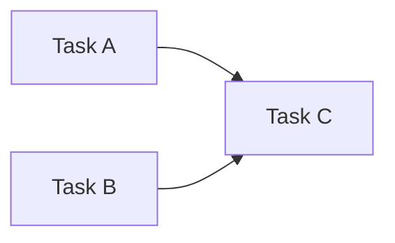

# `aroma_types`

Used for organizing tasks using with graph theory.

All tasks should have simple `dependsOn(...)` declarations that are used to order the tasks. 
This wil enable us to then create a task graph to try to efficiently compile aroma files.

Let's say we have three tasks, _A_, _B_, and _C_, where _C_ depends on _A_ and _B_. This
should result in a task graph of 

This means that Task _A_ and Task _B_ could be run simultaneously. 
